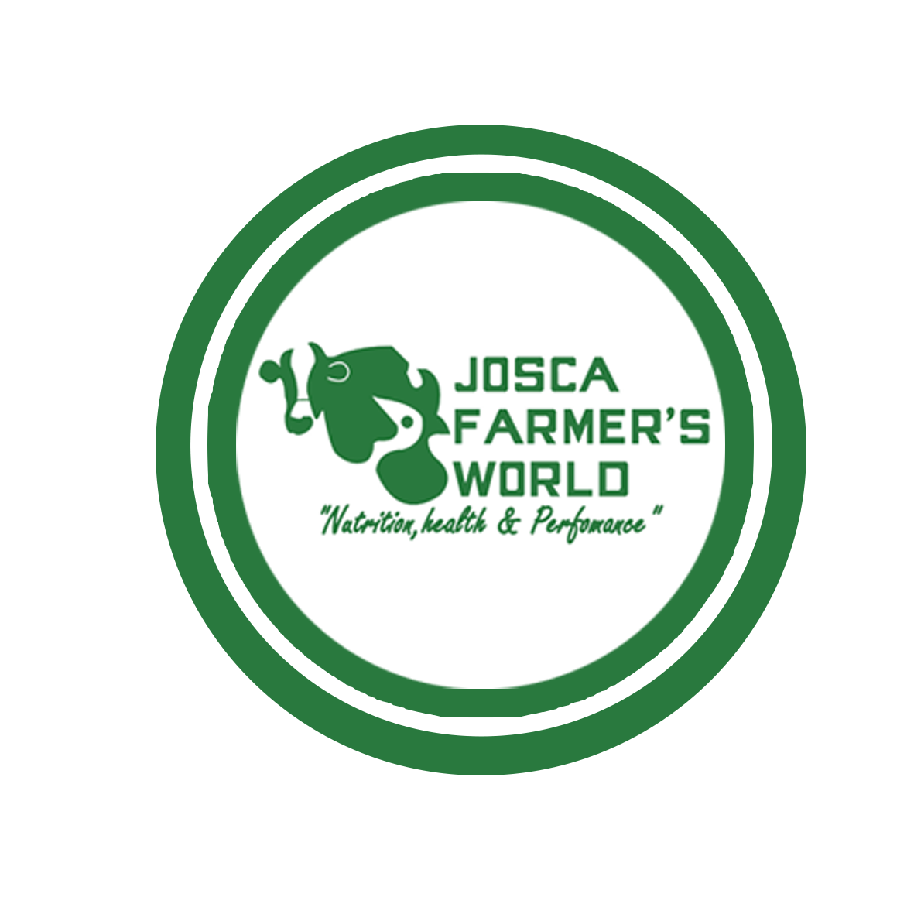

# Josca Farmer's World - Official Website

A modern, responsive website for Josca Farmer's World Ltd, Uganda's leading bulk importers and distributors of day-old chicks, poultry equipment, livestock feed supplements, and additives.

## About Josca Farmer's World

Josca Farmer's World Ltd has been serving Uganda's agricultural community since 2012, providing premium poultry and livestock solutions. We specialize in:

- Day-old chicks (broilers, layers, indigenous breeds)
- Poultry equipment and housing solutions
- Livestock feed supplements and additives
- Veterinary supplies and medications
- Agricultural consulting services

## Features

- **Modern Design**: Clean, professional design with agricultural green color scheme
- **Mobile Responsive**: Optimized for all devices and screen sizes
- **SEO Optimized**: Comprehensive SEO with structured data and meta tags
- **Fast Performance**: Built with Next.js 15 for optimal performance
- **Accessibility**: WCAG compliant with proper ARIA labels and semantic HTML
- **Multi-page Structure**: Dedicated pages for products, services, about, contact, and branches

## Tech Stack

- **Framework**: Next.js 15 (App Router)
- **Styling**: Tailwind CSS v4
- **UI Components**: shadcn/ui
- **Typography**: Playfair Display (headings) + Source Sans Pro (body)
- **Icons**: Lucide React
- **Analytics**: Vercel Analytics
- **Deployment**: Vercel

## Project Structure

\`\`\`
├── app/
│   ├── about/                 # About page
│   ├── branches/              # Branch locations
│   ├── contact/               # Contact page
│   ├── products/              # Products overview
│   │   └── [category]/        # Dynamic product detail pages
│   ├── services/              # Services page
│   ├── globals.css            # Global styles
│   ├── layout.tsx             # Root layout
│   ├── loading.tsx            # Loading UI
│   ├── manifest.ts            # PWA manifest
│   ├── not-found.tsx          # 404 page
│   ├── page.tsx               # Homepage
│   ├── robots.ts              # Robots.txt
│   └── sitemap.ts             # XML sitemap
├── components/
│   ├── ui/                    # shadcn/ui components
│   ├── about-hero.tsx         # About page hero
│   ├── about-section.tsx      # Homepage about section
│   ├── achievements-section.tsx # Achievements display
│   ├── branches-grid.tsx      # Branch locations grid
│   ├── breadcrumbs.tsx        # Navigation breadcrumbs
│   ├── contact-form.tsx       # Contact form
│   ├── featured-products.tsx  # Product showcase
│   ├── footer.tsx             # Site footer
│   ├── hero-section.tsx       # Homepage hero
│   ├── navigation.tsx         # Main navigation
│   ├── product-categories.tsx # Product categories
│   ├── scroll-to-top.tsx      # Scroll to top button
│   ├── services-section.tsx   # Services overview
│   └── structured-data.tsx    # SEO structured data
├── public/
│   └── images/                # Static images
└── lib/
    └── utils.ts               # Utility functions
\`\`\`

## Pages Overview

### Homepage (`/`)
- Hero section with company introduction
- Featured products showcase
- About section highlighting company values
- Services overview
- Achievements and milestones
- Contact call-to-action

### Products (`/products`)
- Product categories overview
- Featured products grid
- Category-specific detail pages (`/products/[category]`)

### Services (`/services`)
- Comprehensive service offerings
- Consulting and support services
- Training programs

### About (`/about`)
- Company history and mission
- Leadership team
- Core values and achievements
- Timeline of major milestones

### Contact (`/contact`)
- Contact form
- Company contact information
- Branch locations with addresses and phone numbers

### Branches (`/branches`)
- Detailed information about all 6 branch locations
- Contact details for each branch
- Service areas coverage

## Getting Started

### Prerequisites

- Node.js 18+ 
- npm or yarn or pnpm

### Installation

1. Clone the repository:
\`\`\`bash
git clone https://github.com/your-username/josca-farmers-world.git
cd josca-farmers-world
\`\`\`

2. Install dependencies:
\`\`\`bash
npm install
# or
yarn install
# or
pnpm install
\`\`\`

3. Run the development server:
\`\`\`bash
npm run dev
# or
yarn dev
# or
pnpm dev
\`\`\`

4. Open [http://localhost:3000](http://localhost:3000) in your browser.

### Build for Production

\`\`\`bash
npm run build
npm start
\`\`\`

## SEO Features

- **Structured Data**: JSON-LD markup for organization and products
- **Meta Tags**: Comprehensive Open Graph and Twitter Card support
- **Sitemap**: Automatically generated XML sitemap
- **Robots.txt**: Search engine crawling instructions
- **Semantic HTML**: Proper heading hierarchy and semantic elements
- **Performance**: Optimized images and lazy loading

## Branch Locations

Josca Farmer's World operates 6 branches across Uganda:

1. **Kampala (Head Office)** - Bweyogerere, Next to Watoto Church
2. **Entebbe** - Serving central region
3. **Jinja** - Eastern region coverage
4. **Mbarara** - Western region hub
5. **Gulu** - Northern region operations
6. **Mbale** - Eastern highlands coverage

## Contact Information

- **Phone**: +256 392 002054
- **Email**: info@joscafarmersworld.com
- **Website**: https://joscafarmersworld.com
- **Address**: Bweyogerere, Next to Watoto Church, Kampala, Uganda

## Contributing

1. Fork the repository
2. Create a feature branch (`git checkout -b feature/amazing-feature`)
3. Commit your changes (`git commit -m 'Add amazing feature'`)
4. Push to the branch (`git push origin feature/amazing-feature`)
5. Open a Pull Request

## License

This project is proprietary software owned by Josca Farmer's World Ltd. All rights reserved.

## Development Credits

Website developed by **BytebaseTech** - Professional web development and digital solutions.

---

**Josca Farmer's World Ltd** - *Nutrition, Health & Performance*

Serving Uganda's agricultural community since 2012.
